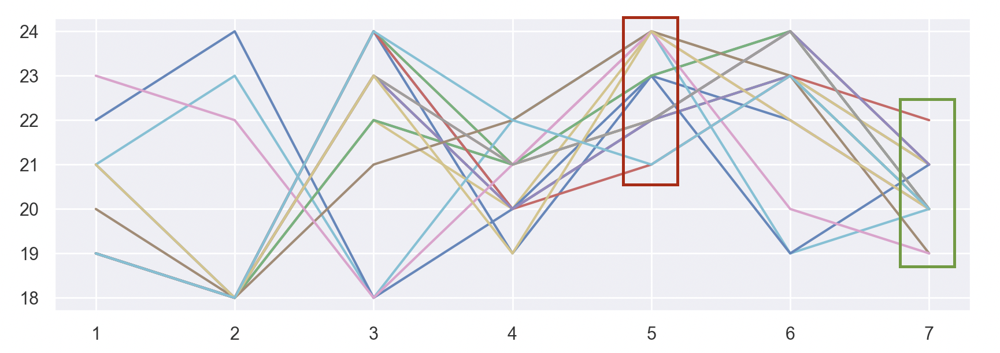
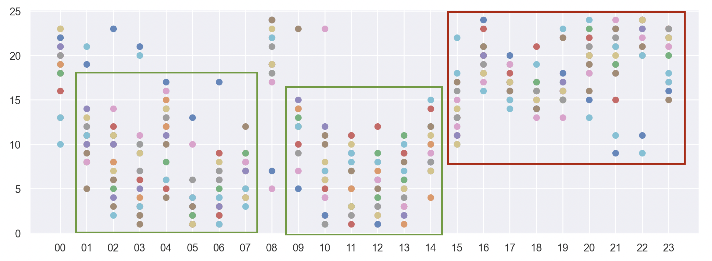
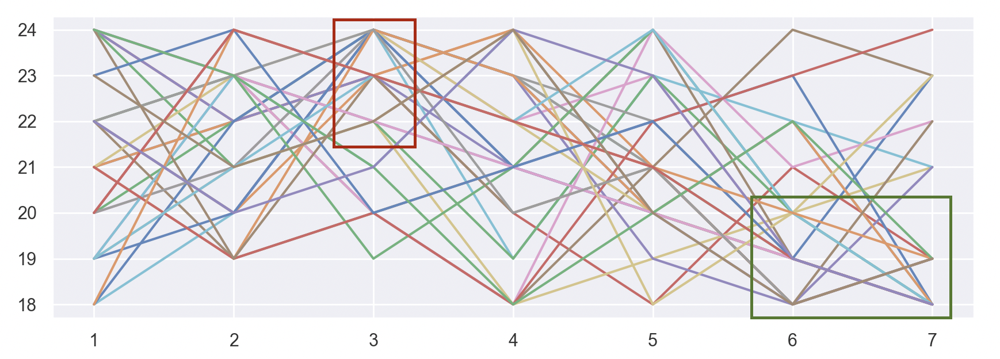

## 介绍

本仓库提供了基于币安 (Binance) 的二级市场舆情系统，可以根据自己的需求修改代码，设定各类告警提示

## 代码结构

- binance.py - 与币安API交互
- data_loader.py - 数据相关的读写
- monitor.py - 监控的核心方法实现
- analyze.py - 基于历史数据进行数据分析
- utils.py - 通用函数
- alarm.mp3 - 监控提示音，可以使用同名的其他mp3文件代替

## 使用说明

下载本仓库：

```shell
git clone https://github.com/geyingli/binance-monitor.git
cd binance-monitor
```

前往[币安官网](https://www.binance.com/zh-CN)注册账号，在API管理页面获取API Key和Secret Key，在本目录下新建 `api.conf` 文件并按如下格式填写 (json规范)：

```json
{
    "API Key": "XXX",
    "Secret Key": "XXX"
}
```

通过 `python3 monitor.py` 指令运行监控程序。稍等历史价量数据下载完成后，可以看到类似于以下的打印信息：

```
开始执行价量监控...
2021年11月2日 15:52:00 >>> MBOXUSDT, $4.53, 交易量突增 ($51万)
2021年11月2日 15:57:00 >>> DENTUSDT, $0.00743, 交易量突增 ($100万)
2021年11月2日 15:59:00 >>> ZECUSDT, $177, 交易量突增 ($45万)
2021年11月2日 16:09:00 >>> AUDIOUSDT, $2.74, 交易量突增 ($56万)
2021年11月2日 16:15:00 >>> DENTUSDT, $0.00745, 交易量突增 ($84万)
2021年11月2日 16:30:00 >>> ENJUSDT, $2.96, 交易量突增 ($189万)
2021年11月2日 16:31:00 >>> AUDIOUSDT, $2.8, 交易量突增 ($91万)
2021年11月2日 16:36:00 >>> ATAUSDT, $1.164, 交易量突增 ($21万)
2021年11月2日 16:37:00 >>> LRCUSDT, $1.020, 交易量突增 ($156万)
2021年11月2日 16:38:00 >>> DGBUSDT, $0.0582, 交易量突增 ($42万)
2021年11月2日 16:41:00 >>> TLMUSDT, $0.28, 5分钟内价格上涨5%
2021年11月2日 16:49:00 >>> LRCUSDT, $1.053, 交易量突增 ($184万)
```

## 数据分析

分享一些我们在数据分析上获取的有意思的观察

#### 价格变动 (以天为周期)

我们取了头部的几十个币种，按每分钟价格涨跌百分比绘制了如下图形。可以看出，北京时间14~19点价格走势普遍偏弱 (因为这个时间美国人在睡觉?)，而晚上23点和早上5点则是涨幅分布更密集的时间


#### 价格变动 (以周为周期)

同样，我们从周一到周天的粒度对涨幅进行统计，可以看出，周五是上涨最多见的一天，跌幅第一则以周日最为显著



#### 交易量变动 (以天为周期)

下午15点开始到凌晨1点是交易量最高的一段时间



#### 交易量变动 (以周为周期)

从周一到周日的视角，周六和周日的交易量最低，而周三的平均交易量最高



## 尾言

本repo在持续使用和优化中。使用中文编写，助力海内外华人割到全世界的韭菜